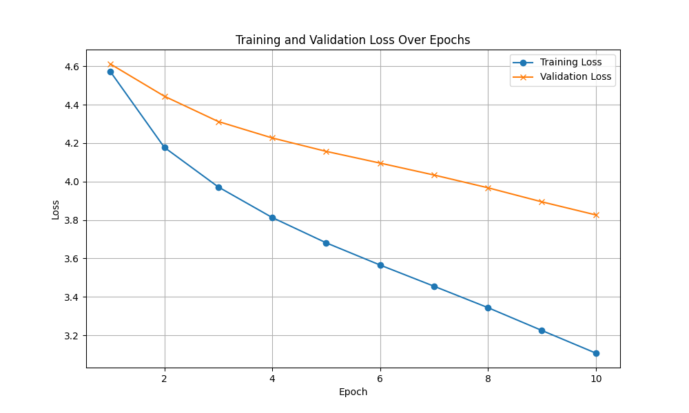

# 🧠 BERT2BERT Summarization with Attention Visualizations using MLX

A custom encoder-decoder transformer built from scratch in [MLX](https://github.com/ml-explore/mlx), designed for text summarization using a pretrained BERT encoder and a lightweight BERT-style decoder. Trained on whole WikiText-103-v1 dataset (100 million tokens) in under 2 hours and Finetuned on the CNN/Dailymail dataset for text summarization (300,000 unique news articles or around 260 million tokens) within 4 hours.

INSERT GIF HERE **************************
https://github.com/charmbracelet/vhs

---

### 🚀 Features

- ✅ Encoder trained from scratch on Wikitext
- ✅ Custom lightweight decoder with cross-attention
- ✅ Inference script for summarization
- ✅ Layer-wise, head-wise attention visualization
- ✅ Macbook compatibility for training and inference

---

### 🧪 Example Output

**Input:**
> The history of natural language processing generally started in the 1950s, although work can be found from earlier periods.

**Summary:**
> NLP began in the 1950s but has roots in earlier research.

---

### 🫵 Running the Model

##### Before usage:

Install your requirements
> pip install -r requirements.txt

Change your config parameters (model architecture and training parameters) to your liking in the config.yaml file
'''yaml
model:
   num_embd: 256              # number of dimensions to represent the token
   num_layers: 4              # number of transformer blocks
   num_heads: 8               # Number of attention heads per block (head_dimension = num_embd//num_attention heads)
   hidden_embd: 1024          # Overall FeedForward dim size (4 * n_embd)
   vocab_size: 30522          # number of tokens in the vocabulary
   block_size: 64             # Context size

training:
   batch_size: 32             # Batches trained at the same time
   num_epochs: 15             # number of complete passes through the dataset
   learning_rate: 0.0003      # learning rate for training
'''

##### Usage:

How to train the BERT encoder?
> python train.py

How to finetune the BERT2BERT (encoder-decoder) model?
> python bert2berttrain.py

How to run this model?
> python generate.py

How to use the interactive CLI (command line interface)?
- To exit the CLI, run:
> >exit

- To run a ROUGE score evaluation, run:
> >eval

- You can input your own text for summarization:
> >Yesterday, I went to the park and saw many children playing on the swings and slides. It was a beautiful, sunny afternoon.

- You can upload a file to summarize:
> >file file.txt

---

### Architecture

Naous, Tarek & Antoun, Wissam & Mahmoud, Reem & Hajj, Hazem. (2021). Empathetic BERT2BERT Conversational Model: Learning Arabic Language Generation with Little Data. 10.48550/arXiv.2103.04353. 

#### Overview

BERT2BERT is an encoder-decoder model where both the encoder and the decoder are BERT models, inspired by this [paper](https://arxiv.org/pdf/1907.12461). Bidirectional Encoder Representations from Transformers or BERT is a Natural language processing model which uses bidirectional encodings (both forwards and backwards) to provide context to words in a sentence. BERT models are pretrained on MLM (masked language modeling) and/or next sentence prediction (which we are not doing here). By pretraining it on masked language modeling, we can allow the BERT model to learn deep contextual representations for each word.

https://www.geeksforgeeks.org/nlp/cross-attention-mechanism-in-transformers/

Now, since sentence summarization is a Sequence-to-Sequence task (Seq2Seq), we require an decoder to "uncover" what the encoder has found. Here, we are taking the BERT model and slightly altering it to understand the encoder's information and generate an autoregressive summary of the input. Here we employ two different techniques.
- Cross Attention Layers - these act as the handshake between the encoder and decoder and will allow the sharing of information from the encoder to the decoder. This is done by allowing the decoder to "attend" to the encoders's output, which in turn will allow the decoder to use that information.

'''py
class CrossAttention(nn.Module):
    def __init__(self, num_embd, num_heads):
        super().__init__()
        self.num_heads = num_heads
        self.head_dim = num_embd // num_heads
        self.scale = math.sqrt(self.head_dim)

        self.q = nn.Linear(num_embd, num_embd) // creating linear for the queries
        self.k = nn.Linear(num_embd, num_embd) // creating linear for the keys
        self.v = nn.Linear(num_embd, num_embd) // creating linear for the values
        self.output = nn.Linear(num_embd, num_embd)

    def __call__(self, x, context, mask=None, return_attn=False):
        assert x.ndim == 3, f"x should be (B, T, E) but got shape {x.shape}"
        B, T, _ = x.shape

        q = self.q(x).reshape(B, T, self.num_heads, self.head_dim).transpose((0, 2, 1, 3)) // Uses self trained queries
        k = self.k(context).reshape(B, -1, self.num_heads, self.head_dim).transpose((0, 2, 1, 3)) // uses "context" from the encoder to inform the key matrix
        v = self.v(context).reshape(B, -1, self.num_heads, self.head_dim).transpose((0, 2, 1, 3)) // uses "context" from the encoder to inform the value matrix

        attn_scores = (q @ mx.transpose(k, (0, 1, 3, 2))) / self.scale   // matmul the queries and keys

        if mask is not None:
            attn_scores = mx.where(mask == 0, -1e9, attn_scores) // adds upper triangle mask

        attn_weights = mx.softmax(attn_scores, axis=-1)
        output = attn_weights @ v       // matmul the attentions and values
        output = output.transpose((0, 2, 1, 3)).reshape(B, T, -1)

        output = self.output(output)

        if return_attn:
            return output, attn_weights // this is for creating attention maps
        
        return output
'''

- Causal Masking - This is a very important technique in attention mechanisms and is used to prevent models from peeking at "future" tokens. So, when the decoder is training, it learns to not use the future tokens to provide context to the previous tokens (exactly like how we read from left to right... you dont know what the end of the sentence is until you have read from the start)

#### Training:
- I used the **Wikitext_103_v1** Dataset to pretrain my BERT models on a variety of information. This dataset was chosen due to its preservation of punctuation and other natural language formatting. In addition, the Wikitext 103 dataset holds a variety of different tokens (making it more suitable to handle more words) and allows plenty of opportunities for BERT to learn using masked language modeling.
- I used the **CNN/DailyMail** Dataset to finetune the BERT2BERT model on a multitude of news articles and their summaries. This will teach the model to understand the document or text provided and create an abstractive summary (rewriting from scratch) about that piece of text. The summaries are human written by professional journalists and provides information about a variety of articles and topics.

<!-- - Attention Maps:
 -->

- Validation and Training Loss Graphs
